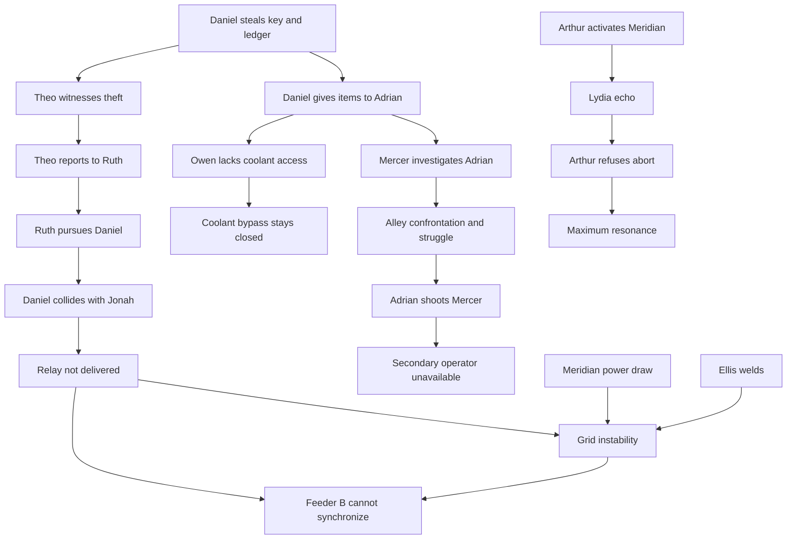

# Causality graph and paper rules

The five chains and five true-ending conditions are **CANON v0.1**. All precise guards, added durations, and alternate schedules below are **PROPOSED v0.2** for desk testing. See [decision log](17_DECISION_LOG.md).

## Five chains

Arrows describe the baseline, not unconditional implications. Theft without an eyewitness does not create a report; a report without Ruth available does not create this chase. Saving Mercer does not automatically change grid, coolant, or Arthur.

## Minimum paper state

| State | Initial value |
| --- | --- |
| `key_owner`, `ledger_owner`, `notebook_owner` | Mercer, Mercer, Mercer |
| `relay_owner`, `relay_installed` | Depot, false |
| `theo_available`, `theft_witnessed`, `theft_reported` | true, false, false |
| `ruth_assignment`, `daniel_route` | patrol, normal |
| `jonah_injured`, `mercer_alive` | false, true |
| `coolant_access`, `bypass_active` | locked, false |
| `welder_on`, `grid_controlled`, `feeders_ready` | false, false, false |
| `arthur_consent`, `mercer_ready`, `mara_briefed` | false, false, false |
| `shutdown_mode` | charging |

NPC locations, remaining task time, local beliefs, and radio messages must be tracked alongside these summary values. A global truth flag does not make every NPC know that truth.

## Event contracts

| Event/time | Required state | Effect | If requirement fails |
| --- | --- | --- | --- |
| Theo departure 8:03:00 | Not retained by Clara | Reach café exterior by 8:03:20 | Stay supervised; no replacement eyewitness |
| Theft 8:03:20 | Daniel accepts job, both present, items held by Mercer and reachable | Transfer each available target item separately to Daniel | Missing items are not duplicated; no successful theft if neither acquired |
| Witness 8:03:20 | Theo present with sight line; successful theft | Theo knows theft | No report |
| Report 8:04:00 | Theo witnessed and can reach Ruth | Ruth knows report | No chase from this source |
| Chase 8:04:15 | Ruth available, report received, Daniel visible | Daniel uses fleeing route | Daniel follows normal route |
| Collision 8:04:45 | Daniel fleeing and Jonah at junction | Jonah injured; relay on ground | Both continue |
| Parcel recovery 8:05:15 | Parcel on ground, Naomi available | Naomi owns parcel; completes shop return by 8:05:30 | No duplicate pickup |
| Handoff 8:05:55 | Daniel and Adrian at rendezvous | Transfer only stolen items in Daniel's possession | Adrian waits until 8:06:10, then leaves empty-handed |
| Missing-item discovery 8:06:10 | Key or ledger absent | Mercer investigates theft | Mercer follows shutdown work route |
| Coolant entry 8:07:00 | Owen present and has valid access | Begin two-minute bypass task | Wait and request access; alarm later |
| Confrontation 8:10:40 | Mercer pursues; Adrian present and free | Demand, struggle possible | No scheduled substitute murder |
| Shooting 8:11:00 | Struggle occurs, Adrian armed, no effective intervention | Mercer dies | Mercer stays alive; define resulting local response |
| Isolation test 8:12:15 | Relay installed | Feeder B test succeeds | Test fails |

**Clara rule:** complete a 15-second warning by 8:03:00. She keeps Theo at school until at least 8:04:30. A late warning does not erase an observation already made. Theo's 20-second school-to-café route is a proposed direct edge requiring map validation; it is not derived from the square walking times.

**Daniel without pursuit:** café exterior 8:03:20 → church rear 8:04:20; wait for the fixed 8:05:55 handoff. Samuel sees him waiting at 8:05:40, not fleeing. No collision, but theft still harms coolant access and can lead to murder.

**Preventing theft:** Daniel leaves the job without receiving payment; Mercer retains both objects and does not pursue Adrian at 8:10. Suppression of records remains a problem, but a replacement shooting is not invented to preserve the original plot.

**Partial theft:** ledger theft can still motivate pursuit/murder while coolant access succeeds; key-only theft still blocks coolant and can trigger an investigation through Grace. The A–G traces cover both-items theft or neither. Partial-theft routes are additional required cases before Gate G closes.

## Item conservation

Each physical item has exactly one owner or location. Transfer requires co-location and possession. Destroyed, seized, dropped, and installed are explicit locations/states. Reset restores snapshot ownership, not final-loop ownership.

At 8:11:10 Adrian retains key and ledger and takes **only Mercer's notebook**, unless the struggle explicitly dropped an item. An arrested Adrian's property enters police custody; it does not automatically teleport to Owen.

## Alternate solutions and their status

| Problem | Source solutions | Paper readiness |
| --- | --- | --- |
| Key/access | Prevent theft; take key from Daniel/Adrian; persuade Daniel; enlist Vincent; church route | Prevent-theft path specified; other durations/access rules open |
| Murder | Warn Mercer; inform Ruth; remove gun; prevent theft; trap Adrian; enlist Iris; challenge alibi | Warn/prevent-theft defined here; other branches need schedules and evidence rules |
| Relay | Prevent chase/collision; recover parcel from Naomi | Proposed delivery route in map; Naomi hands parcel to Avery after a 15-second request identifying recipient |
| Grid | Relay, suppress welder, workshop breaker, enough stability for Mara to compensate | Installed relay path defined; relay-free compensation not yet proven |
| Arthur | Simon's explanation plus Sophie's emotional support | Consent can be gained early; coordinated shutdown still required |

Recovering the relay after injury solves delivery, not Jonah's injury. Suppressing the welder reduces a disturbance but does not conjure missing synchronization hardware. The relay-free route requires its own specified mechanism before being treated as a solution.

## Proposed cooperative schedules

- Mercer safe, key retained: his existing shutdown plan takes him to Owen at coolant access by 8:07:00 to transfer the key, even without a player briefing. He is available for a 20-second briefing at Town Hall from 8:04:00. With that coordinated plan, after a one-minute task at coolant access, he leaves at 8:08:00 and reaches observatory by 8:10:05 using the conservative substation → square → observatory route (125 seconds). Without the briefing, later operator readiness is not assumed. Coolant entrance is treated as adjacent to substation for this paper pass only.
- Mercer warned away from the alley without recovering key: remains alive, but coolant remains locked. He proceeds toward the observatory only after being briefed; survival alone does not confer readiness.
- Owen with access: spends two uninterrupted minutes entering and opening bypass. Access at 8:07 means active at 8:09; access by 8:12:30 permits readiness at 8:14:30. Missing the deadline blocks the safe sequence.
- Mara: relay installation takes 120 uninterrupted seconds, followed by a 30-second test. She needs a 20-second Meridian briefing and explicit shutdown coordination. Relay handoff by 8:05:30 permits installed/tested state at 8:08:00. Prepare by 8:14:30; holding position is work, not teleportation.
- Arthur: early credible explanation with Sophie present produces consent and a lower-gain holding state. The charged field cannot be safely discharged by simply pressing stop. He waits for coolant, grid, and both operators. Exact holding-state catastrophe timing is an unvalidated fiction/engineering assumption.
- Ruth: a specific prediction can justify observation; witnessing a theft/handoff or obtaining a current-loop statement changes her response. Remembered guilt alone is not an automatic arrest trigger.
- Eleanor after Adrian detained: seeks an explanation, continues withholding files, and does not arrange a replacement killing. She does not automatically learn about Meridian or authorize an abort.

## Safe shutdown contract

Source requires all five: Mercer alive; coolant bypass active; grid controlled; Mara can isolate both feeders; Arthur willingly aborts.

**PROPOSED operational expansion:** by **8:14:30**, Mercer is alive **and at the observatory, informed and ready**; Owen confirms bypass; relay is installed/tested; Mara confirms both feeders ready and is present; Arthur consents at the primary console. Participants use the existing radio network, with confirmation messages tracked.

1. 8:14:40: Mara isolates both feeders after all confirmations.
2. 8:14:48: Arthur enters abort and Mercer verifies under retained local control power.
3. 8:14:55: stable unwinding begins.
4. 8:15:00: no collapse; clock continues to 8:16.

Control power surviving feeder isolation is a proposed Meridian property, not a new gameplay subsystem. Exact boundary: prerequisites completed at 8:14:30 are accepted; later completion is too late for this safe sequence. Simultaneous completions resolve before readiness evaluation. Other input ties use the deterministic ordering in [technical design](11_TECHNICAL_DESIGN.md).

Failing a readiness check prevents the **safe** sequence; it does not prove which alternate ending follows. Blackout, Echo, Anchor, and Road need separate physical contracts. The paper traces below assume no alternate-ending action and use collapse/reset as the provisional failure outcome.
